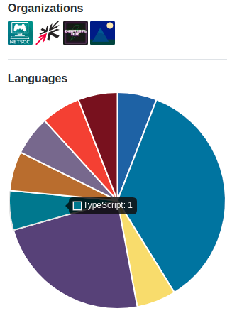

A little Chrome Extension that draws a pie chart on GitHub User / Org profiles detailing their language breakdown. Built with TypeScript, Chart.js and :heart:.

Recently, I have wanted a little graph that shows the language breakdown of a user or organisation right on their profile.

So I decided to make just that!

## Install
### Chrome

Click the badge to be taken to the web store page for this plugin!

### Firefox
Firefox version is planned but currently not even started, although I doubt there'll be much to change.

## Usage
Just by having the extension installed, it's already working!

Simply visit a User's profile page (why not [mine](https://github.com/crnbrdrck)?) and you'll see something to similar to the following image on the left sidebar: 

All the colours are pulled from GitHub's official language colours, and hovering over any section will tell you the language and how many repos the user has made in that language. Simple! :smile:

Also, by clicking on one of the segments, you can be redirected to a list of repos by that user in that language!

The same now works for [Orgs](https://github.com/github)

## Chrome v1 Major Release
As far as I can tell, I think the extension is ready for a full release now.

I'm going to give it until the end of August for any bugs to come in (I might post it on Reddit or something) and then I'll mark the release as v1.0.0

After that, I might write a Firefox version too, who knows?

## Want to Contribute?
Contributing doesn't just mean writing code!

If you think of anything that could benefit the project, open up an [issue](https://github.com/crnbrdrck/github-user-languages/issues).

I'm also not that great at writing READMEs so help with this one would be very welcome!

### Development Process
1. Fork the repo, download your fork and install the dependencies with `npm install`
2. Run `npm run watch` to start the watch and build process
    - This will build the TypeScript into `dist/js`
3. Visit `chrome://extensions` in your browser
4. Turn on Developer Mode
5. Click `Load Unpacked`
6. Open the `dist` folder in the prompt that is displayed
7. The extension should now be loaded from the local directory

#### Notes
- Whenever you make changes to the extension, the JS will compile automatically but you'll need to click the little circle arrow on `chrome://extensions` to reload the extension
- It's probably a good idea to turn off the release version while you're doing development so they don't mess with eachother
- If you want to turn off caching while in development, simply uncomment the `return reject();` at line 37 of `data.ts`

## Boilerplate
Boilerplate used to set up this project can be found at https://github.com/chibat/chrome-extension-typescript-starter

## Contributors
- [crnbrdrck](https://github.com/crnbrdrck): Creator, maintainer
- [Strum355](https://github.com/strum355): Cleaned up promises with async + await, all round TypeScript mentor
- [ihtiht](https://github.com/ihtiht): Designer of the amazing logo :heart:

## License
MIT
